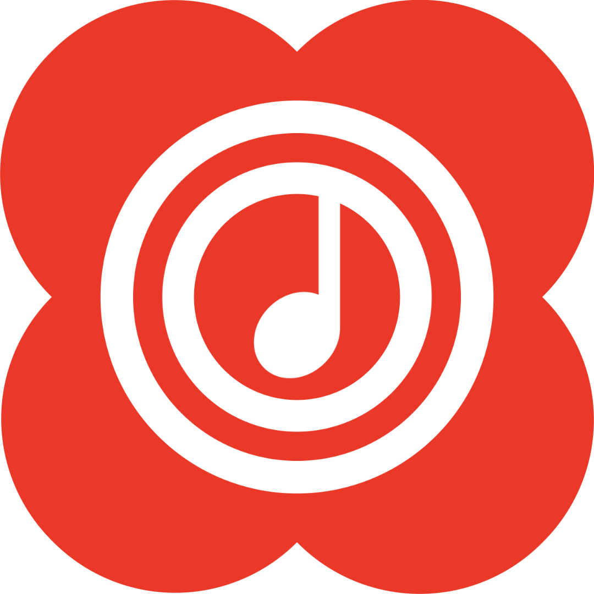

  

  <h1>Echo Music</h1>

  
<b>A modern Android music app with streaming, synced lyrics, offline playback, and an intuitive user experience.</b>

  
  

    <a href="https://github.com/iad1tya/Echo-Music/releases/latest">Download APK</a> •
    <a href="https://buymeacoffee.com/iad1tya">Buy me a Coffee</a> •
    <a href="https://support.iad1tya.cyou">Support</a> •
    <a href="https://instagram.com/iad1tya">Instagram</a> •
    <a href="https://x.com/xad1tya">X</a>
  

---

## Try My Other Projects

If you're on a Mac, check out **Net Bar** — a minimal, native system monitor that lives in your menu bar. Actively maintained and available at [netbar.xyz](https://netbar.xyz).

---

## Features

- **High quality** up-to 256kbps stream for YouTube Music Premium users *(NEW)*
- **Browsing** Home, Charts, Podcast, Moods & Genre with YouTube Music data at high speed
- **Search everything** on YouTube
- **Analyze your playing data**, create custom playlists, and sync with YouTube Music
- **Spotify Canvas** supported
- **Play 1080p video** option with subtitles
- **AI song suggestions**
- **Customize your playlist**, synced with YouTube Music
- **Notifications** from followed artists
- **Caching and offline playback** support
- **Crossfade** with DJ-style like Apple Music *(NEW)*
- **Customizing THEME** (Light, Dark, Color, etc) *(NEW)*
- **Supports SponsorBlock** and Return YouTube Dislike
- **Sleep Timer**
- **Android Auto** with online content, feature-rich UI/UX *(NEW)*

---

## Installation & Setup

Download the latest pre-compiled APK from the [Releases Page](https://github.com/iad1tya/Echo-Music/releases/latest).

---

## Support the Project

If Echo Music has been useful to you, consider supporting its development!

  
  
  

<b>Cryptocurrency Options</b>

 

| Network | Address |
| :--- | :--- |
| **Bitcoin** | `bc1qcvyr7eekha8uytmffcvgzf4h7xy7shqzke35fy` |
| **Ethereum** | `0x51bc91022E2dCef9974D5db2A0e22d57B360e700` |
| **Solana** | `9wjca3EQnEiqzqgy7N5iqS1JGXJiknMQv6zHgL96t94S` |

---

## Special Thanks

After receiving a legal notice, the original repository was unfortunately taken down, meaning I no longer had access to the updated source code. Because of this, I decided to use one of the most stable and reliable open-source clients available—**SimpMusic**—as the new foundation for Echo Music. 

A massive thank you to the SimpMusic developers for their incredible work. I will be building all future updates and features on top of this rock-solid foundation.

---

  
Licensed under the <a href="LICENSE">GPL-3.0 License</a>.

